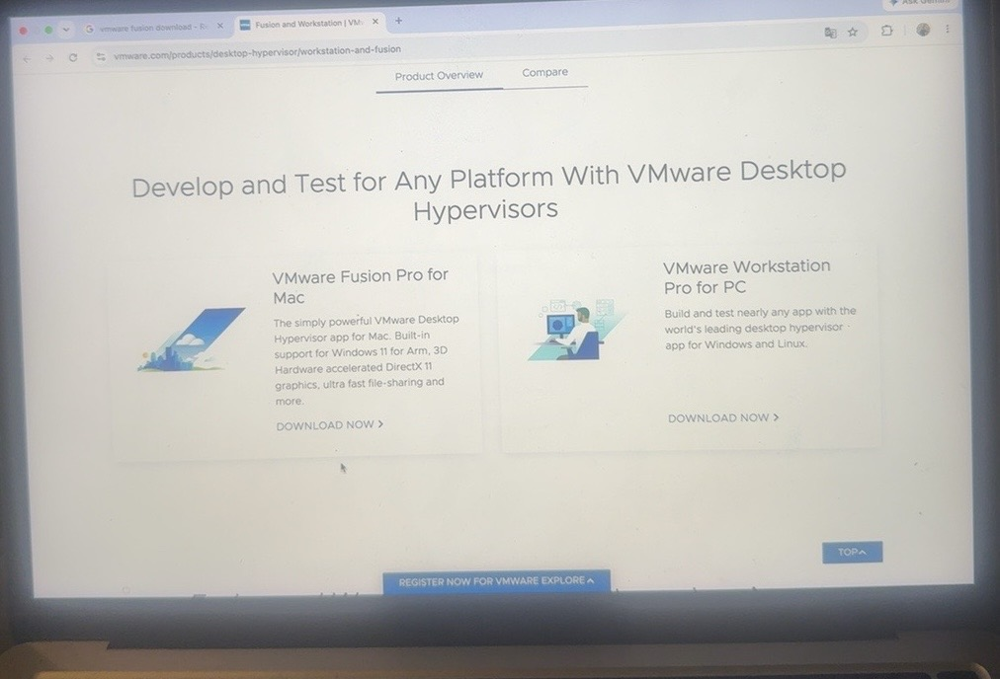
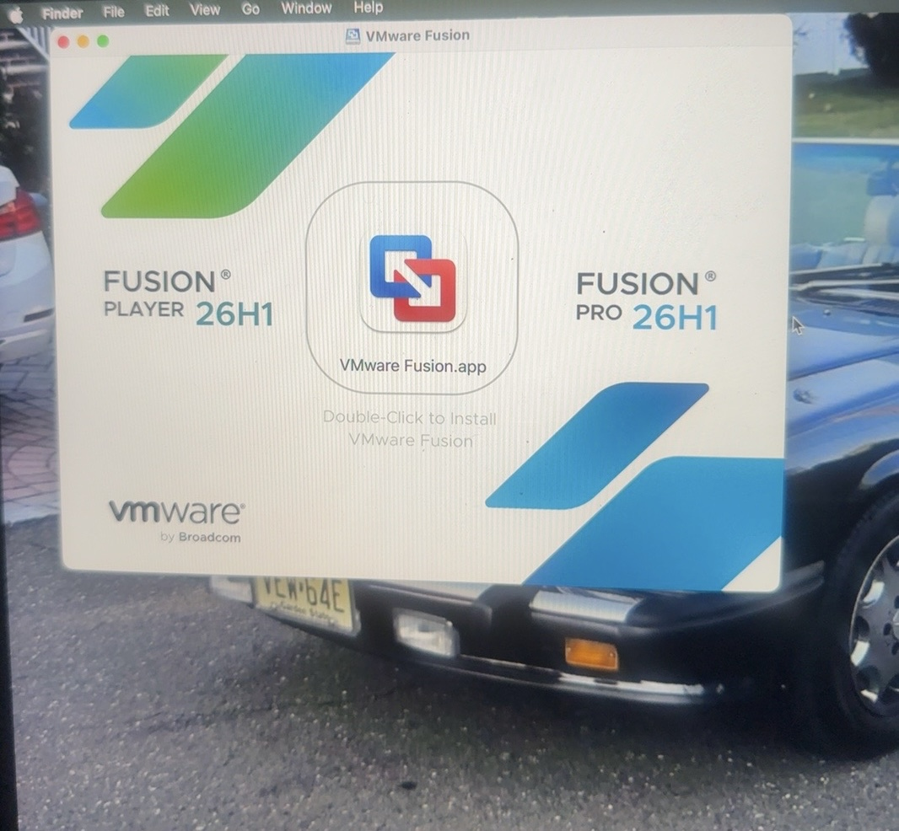
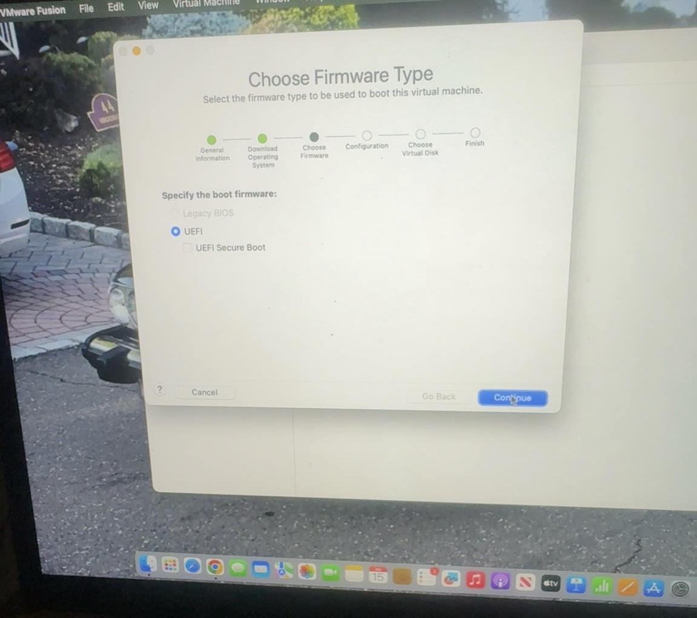
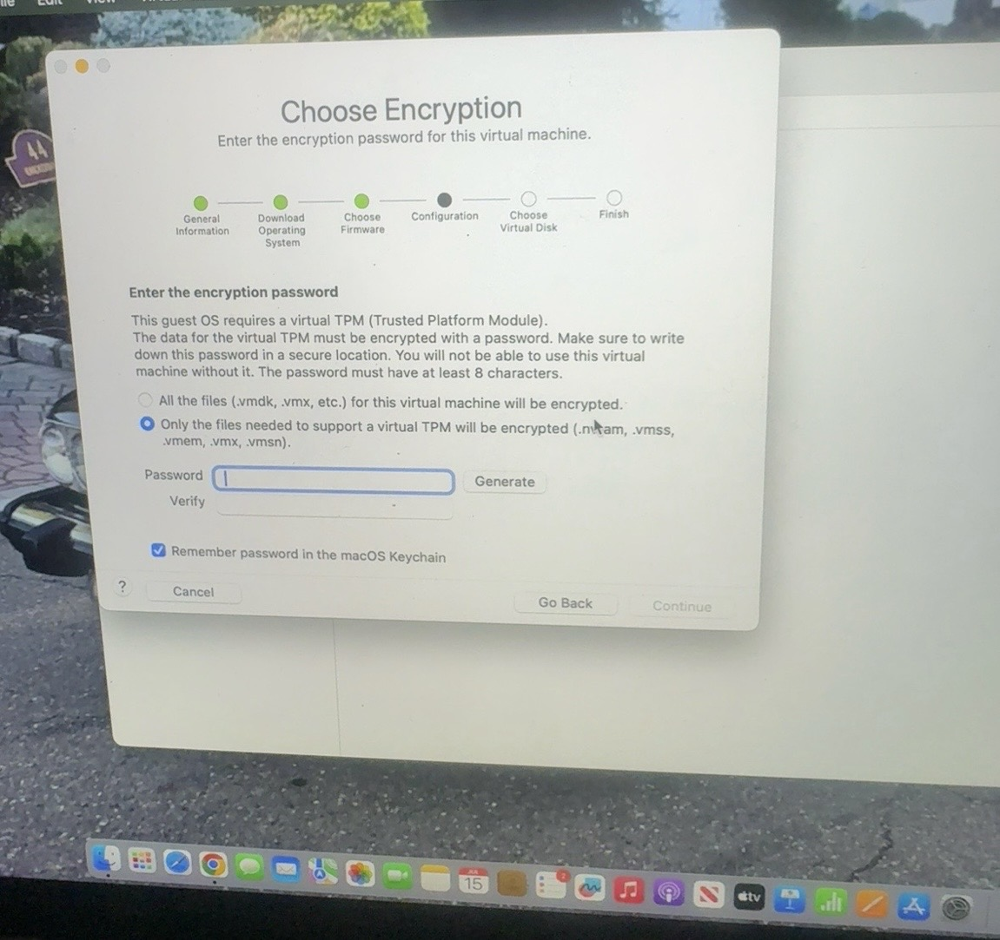
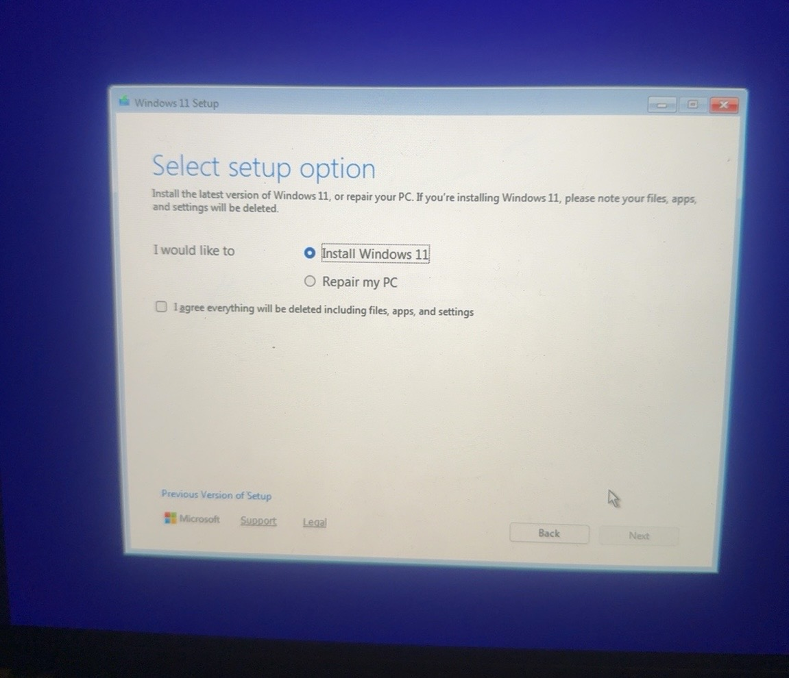
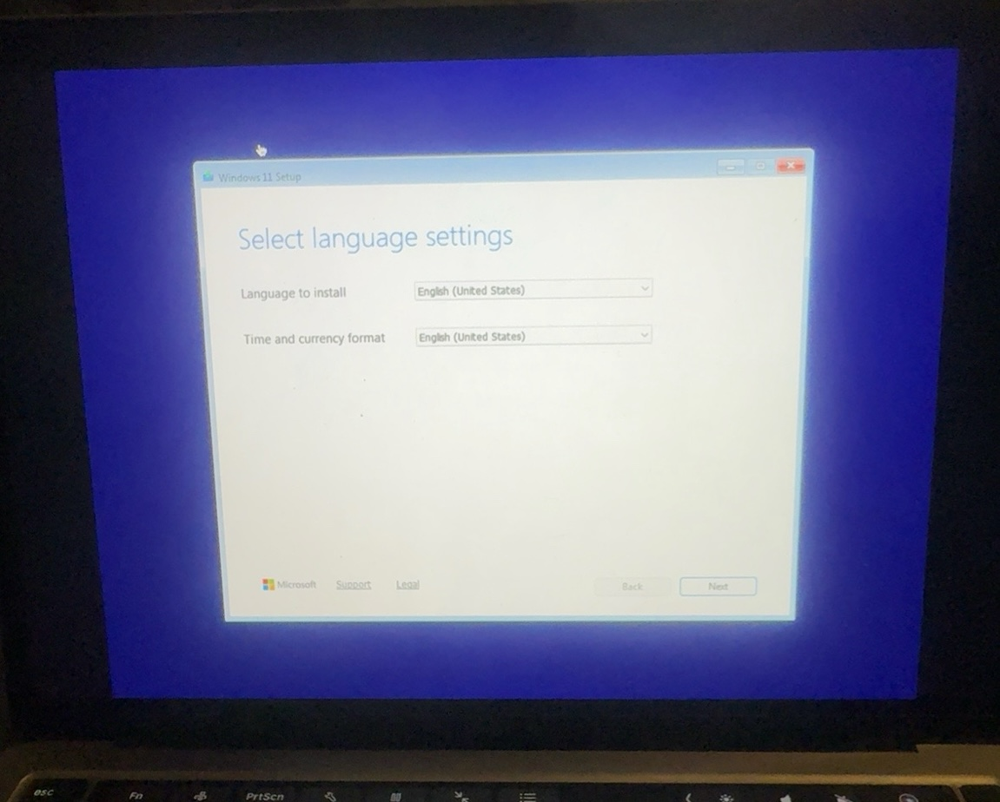

# Windows 11 Virtual Machine Lab

## Project Overview

This project documents the installation of a Windows 11 virtual machine using VMware Fusion on macOS.

---

## Objectives

- ✅ Install VMware Fusion

- ✅ Create a Windows 11 Virtual Machine
- ✅ Configure UEFI Firmware

- ✅ Configure Virtual TPM

- ✅ Complete Windows 11 Installation

- ✅ Prepare the VM for future Active Directory Labs

---

## Hardware

- MacBook Pro
- VMware Fusion
- Windows 11 Pro ARM

---

## Skills Learned

- Virtualization
- VMware Fusion
- Windows Installation
- UEFI Firmware
- Virtual TPM
- Operating System Deployment

---

## Project Screenshots

Screenshots will be added in the next step.

---

## Status

✅ Completed
